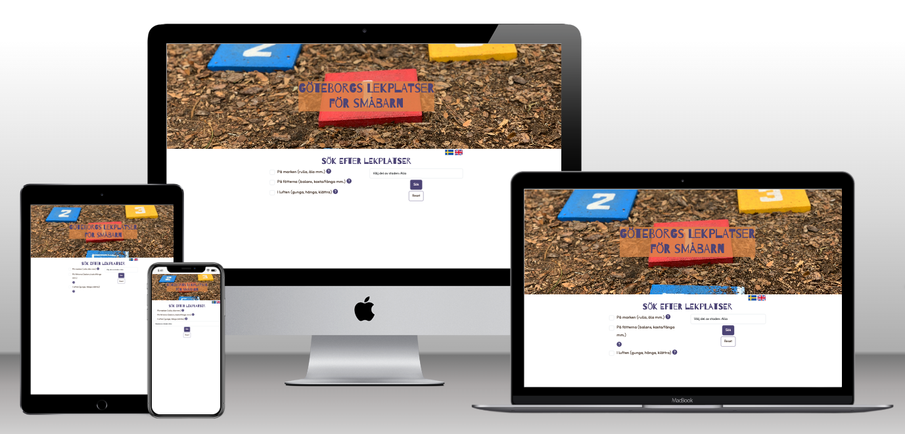
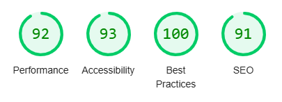
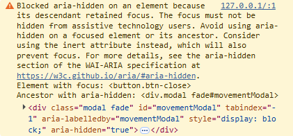
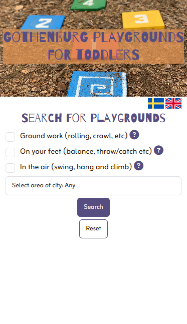
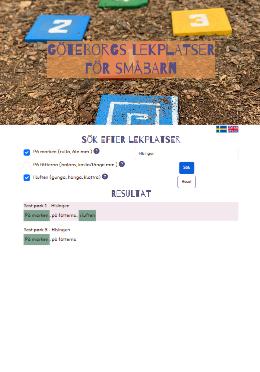
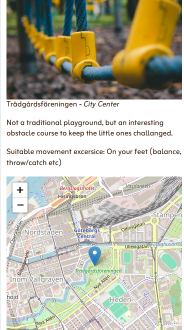
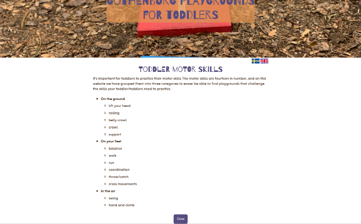

# Milestone Project 2: Gothenburg Playgrounds
  
Picture supplied by mentor Spencer Barriball

## Table of contents

- [Introduction to project](#introduction-to-project)
- [Preliminary project overview](#preliminary-project-overview)
  - [Searching](#searching)
  - [Detailed information](#detailed-information)
  - [Other possible functions to add](#other-possible-functions-to-add)
  - [Pros and cons of project](#pros-and-cons-of-project)
- [Goals](#goals)
- [Overview of users and needs](#overview-of-users-and-needs)
- [User stories](#user-stories)
- [Discussion of user stories](#discussion-of-user-stories)
- [Changes made to user stories during development](#changes-made-to-user-stories-during-development)
- [Basic design of website and page requirements](#basic-design-of-website-and-page-requirements)
- [Alternative outlines considered or tried](#alternative-outlines-considered-or-tried)
- [Wireframes](#wireframes)
- [Colors and fonts](#colors-and-fonts)
- [Programming structure](#programming-structure)
  - [Information storage](#information-storage)
  - [Global variables](#global-variables)
  - [Naming conventions](#naming-conventions)
- [Deployment](#deployment)
  - [Difference in deployed version and development version](#difference-in-deployed-version-and-development-version)
- [Testing](#testing)
  - [Automated testing](#automated-testing)
  - [Manual testing](#automated-testing)
  - [Other validation](#other-validation)
  - [List of notable bugs and errors caught during testing](#list-of-notable-bugs-and-errors-caught-during-testing)
- [Finished website](#finished-website)
  - [User cases completed](#user-cases-completed)
  - [User cases began but not completed](#user-cases-began-but-not-completed)
  - [User cases remaining](#user-cases-remaining)
  - [Future development](#future-development)
    - [Replacing example playground with real playgrounds](#replacing-example-playgrounds-with-real-playgrounds)
   - [Error handling](#error-handling)
   - [HTML, CSS and styling](#html-css-and-styling)
   - [Search engine optimisation](#search-enginge-optimisation)
- [Credits](#credits)

## Introduction to project

The idea for this project is to make a simple web page (more advanced styling and graphics function could be added after project completion, as long as the page functions on both mobiles and computers) to let parents search for playgrounds in Gothenburg depending on different criteria.  
The idea is to make this a live webpage after the completion of the project.

## Preliminary project overview

This preliminary project overview was written to outline the basic scope of the project and present this to mentor and others to discuss the feasibility of the project. After discussion of project idea, functions, pros and cons, a more detailed project documentation was started to document the implementation of the website.

### Searching
The page would for this purpose hold a number of playgrounds, stored in JavaScript objects. When a user search for playgrounds they choose what kind of movement they want to do with their kid(s), size of the playground and part of the city. The program then searches through the list to find those that matches the search criteria.  
An overview list would be presented.

### Detailed information
When clicking on one of the found playgrounds the user will be presented with additional information, such as an overview picture, a short description, and adress/location. Several options for presentation is possible, either using literals to construct the html code or adding innerHTML to already constructed web items. Another option would be to list the search hits in a Bootstrap Accordion, with the titles as hits and detailed information in accordion body elements.

### Other possible functions to add
- Pick a random playground
- Present the page in both English and Swedish, and toggle this with small flag icons
- Integrate APIs such as weather forecasts and travel information (how to get there with public transport) or Map Services

### Pros and cons of project
The following aspects were discussed with mentor Spencer Barriball before settling on the project.
- **The project is heavily dependent on having a large enough list of playgrounds to be usable.**  
Around 10 playgrounds in three different parts of the city would probably be sufficient for project requirements. More information could be added later.
- **Will there be enough variation with Javascript functions to show experience and programming skills?**  
After discussing of what functions would be included we where in agreement that there would be plenty of options to show proficiency in Java Script, including but not necessarily limited to searching object depending user input, creating dynamic html to show search result, possible inclusion of external API and more.
- **Would this project be better suited for later milestones, as when databases are involved?**  
This sort of project would probably normally depend on databases to store information about different playgrounds, rather than hard-code that information into Javascript code. However, the work required to make the project work is still very relevant to this part of the course. Also, since the plan is to take this project live after the assignment, using databases instead of JS could though make it harder to make a live webpage, depending on hosting options. Also, the work made for this assignment could be used as a basis when making alternations in the future.
- **Risk of getting too involved in HTML/CSS**  
With extra styling after project completion, this should make a really nice portfolio project. However, since the focus here is Javascript and dynamic webpages much of the design that normally would be made can be implemented afterwards, or as low-priority tasks if time permits. This will be featured in the User cases and their respective priority.

## Goals

**Primary:** Help parents or custodians of children 1-3 years old choose playgrounds suitable for the children's gross motor skill development. These motor skills are 14 in total, and will for user interface and search purposes be grouped into three categories:  
- Ground work (lift your head, rolling, belly crawl, crawl, support)
- On your feet (balance, walk, run, jump, coordination, throw/catch, cross movement)  
- In the air (swing, hang and climb)

**Secondary:** Make parents or custodians more aware of children's physical development, discover new playgrounds and explore new areas of Gothenburg

## Overview of users and needs

### Who will be using it?

Parents or custodians with toddlers, age 1-3, who are looking for playgrounds. 

### What do the primary users need from the website?

Be able to find a playground suitable for the movement they want to practice with their kid or kids, either nearby or in other parts of Gothenburg. Some may also appreciate a function to randomly pick a playground if they don't know where they want to go on a particular day.

## User stories

The following User Stories was written before development. The third user story, ***Hiding elements on smaller screens*** turned out to give no real value. It was therefore reworked into ***Scrolling to clearly reveal elements on smaller screens*** as discussed in [Changes made to user stories during development](#changes-made-to-user-stories-during-development).  
Github Projects is used to keep track of User stories and completion of them. The checkboxes marked in this ReadMe are those tasks or criteria that has been met upon submission of project.

### User story, Responsive user-friendly website
As a visitor to the site, the webpage should be accessible to visit from all platforms. Searching should be intuitive and results presented clearly.

**Criteria**  
- [X] Responsive website  
- [X] User friendly  

**Tasks**  
- [X] Create a responsive website using Bootstrap grid  
- [X] Make sure all information is presented easily and clearly 

**Priority:** Must-have

### User story, Easy to use search function
As a visitor to the site, search form should be easy to find and use

**Criteria**  
- [X] Search form among the first items to meet user  
- [X] Search function must be easy to use and understand, even without previous knowledge of toddlers motor functions
- [X] Clear overview of search results and specific details, including a message if no playgrounds were found  

**Tasks**  
- [X] Include search form immediately on index page (after banner/hero image)  
- [X] Group search form content in an easy and understandable way
- [X] Present "hit list" overview  
- [X] Include a "no results found" message  
- [X] Present details of clicked "hits", either in new window, below search list, temporarily above search list (either main window or modal). Will test feasibility with Wireframes and real testing  

**Priority:** must-have

### User story, Hiding elements on smaller screen
For a user visiting the site using mobile phones, hiding elements that are not currently used would improve the impression of the webpage and make it easier to get an overview for the parts that are currently active.

**Criteria**  
- [ ] Hide elements not currently needed  

**Task**  
- [ ] On mobile devices, hide search field while displaying results. Search field should be easily accessible again with drop-down button or similar

**Priority:** should-have

**Note:** This User story was not implemented since there was no real need for it. An updated user story that replaced this one can be found in [Changes made to user stories during development](#changes-made-to-user-stories-during-development).

### User story, map functions
As a visitor not familiar with all areas of Gothenburg, including a map service would make it easier to find certain playgrounds.

**Criteria**  
- [X] Show the playgrounds position on a map service  

**Task**  
- [X] Include LeafJet API  

**Priority:** should-have

### User story, Describe toddlers motor function and development
As a parent or custodian, information about different motor skills and development will give a greater understanding of their children(s) physical development.

**Criteria**  
- [X] Easy-to-understand information about motor skills and how they are grouped in the search function  

**Tasks**  
- [X] Provide separate window or modal with information about motor skills and how they are grouped

**Note:** The task was slightly changed during the development due to problem with Bootstrap Modal (as outlined in [List of notable bugs and errors caught during testing](#list-of-notable-bugs-and-errors-caught-during-testing). The information is still available and in a view that does not contain any other information or search field and therefore the task is considered complete.

**Priority:** should-have

### User story, Different language options
As an immigrant or tourist, information in other languages than Swedish would be useful.

**Criteria**  
- [X] Being able to use the page and understand all information on website

**Tasks**  
- [X] Construct the website using English, but make it possible to user to switch between English and Swedish  
- [X] Make Swedish the default language, even though every English text is already present.

**Priority:** should-have

### User story, Pleasing html and css
As a developer, one would want the project look pleasing and attractive as well as being fully functional, before using it as portfolio project or going live with it

**Criteria**  
- [ ] Portfolio-ready website  

**Tasks**  
- [ ] Add additional html and css styling and functionality to improve look of website

**Priority:** could-have

### User story, Public transport information
For a visitor not familiar with Gothenburg or parts of it, information about how to reach playgrounds with public transport would be helpful.

**Criteria**  
- [ ] Being able to use Västtrafiks traffic planner directly from the website  

**Task**  
- [ ] Include travel search with Västtrafik API

**Priority:** could-have
### User story, Pick a playground at random
As a parent who really don't can come up with ideas of what to do a particular day, a nice feature would be to let the website pick a playground at random.

**Criteria**  
- [ ] Being able to pick a playground at random  

**Task**  
- [ ] Implement a function to pick a playground at random, regardless of search criteria  

**Priority:** could-have

## Discussion of User stories

**Aesthetics**
For the scope of this project, the focus is on Javascript and functionality. Therefore, the webpage constructed for User Story 1, Responsive user-friendly website should focus on the functionality of the page on different platforms (computer, tablet, mobile) and to provide just a idea of how a finished website would look. All other styling that does not relate to functionally should be implemented as the last could-have priority, either before submission or after but before project going live and/or being used in portfolio.

**Language**
In a real life situation, the webpage would be developed with Swedish content first, English (and potentially other languages) second. Due to the class being held in English and criteria regarding this, this project will be done the other way around. If more than one language is implemented before project submission, Swedish should be made the default language but switching to English should be easy and intuitive.  
***Update after implementation:*** The website is now featuring both Swedish and English Language, with Swedish being the default language. This is caused by calling the translation function after the DOM tree is fully in place. A more practical approach would have been to have all headlines, labels, etc in Swedish from the beginning. However, since the website was developed in English for education purposes this method was chosen to make the html code and structure easier to follow for non-Swedish-speaking people reviewing the code, even if it involves a function call that would not have been strictly necessary. 

**API inclusion**
Including external APIs, for map service and public transportation, is a desired feature. Even if the website if open to all people, including tourists and those new to Gothenburg, the majority could be expected to be residents of the city and know how to plan for using public transport. Therefore, inclusion of map service is a higher priority than public transportation planner.

## Changes made to user stories during development

### User story, Hiding elements on smaller screen changed to Scrolling to clearly reveal elements on smaller screens
During development and testing, there wasn't any real need to hide the search field to reduce clutter, even on mobile screens. However, it turned out that the search results often wasn't visible without scrolling, and there was therefore no real clue to whether the search function had worked or not. 

**Original user story:** For a user visiting the site using mobile phones, hiding elements that are not currently used would improve the impression of the webpage and make it easier to get an overview for the parts that are currently active.  
**Updated user story:** For a user visiting the site using mobile phones, automatically scrolling the window down to reveal the search results would prevent the user from wondering if nothing happened when pressing the search button.

**Criteria**  
- [X] Search list always visible after pressing search button (originally Hide elements not currently needed).  

**Task**  
- [X] On mobile devices, scroll down automatically after pressing search button to reveal search list (originally hide search field while displaying results. Search field should be easily accessible again with drop-down button or similar).

**Priority:** should-have

## Basic design of website and page requirements

- Index page with search function, "hit list" and detailed overview of items selected from "hit list". Wireframe mock-up and real testing will decide how much information can be handled at once and if fields should be hidden at times, or information should be shown in modals

## Alternative outlines considered or tried

- Using a separate details page for displaying information about as specific playground chosen from the hit list and sending information with querystrings. Mentor Spencer Barriball advocate all information being presented on a single page. This decreases the likelihood of errors, querystring manipulation and also removes the need to construct javascript objects several times. Once everything is read into memory on index page, it stays there as long as the visitor remains on the page.

## Wireframes

Wireframes, version 1. These show the basic view of the page on different platforms. The mobile frames show how the search field could be hidden when displaying results, a desired but not required feature. The same thing goes for the language buttons on the top of each page. A Bootstrap Accordion is used as a stand in for the search results list but may not be actually used. 

### Deviations from original wireframes

It was soon discovered that Playground size didn't play a significant role in the search process, also there was hard to draw a line between sizes and it was easily misunderstood and would need further clarification. Size was therefore omitted from both javascript objects and search fields. Also, actual testing discovered that the movement boxes should always be grouped close together to make it easier to take in all choices at once. The wireframes were therefor reworked into version2.
  
Wireframes, version 1. These show the basic view of the page on different platforms. The mobile frames show how the search field could be hidden when displaying results, a desired but not required feature. The same thing goes for the language buttons on the top of each page. A Bootstrap Accordion is used as a stand in for the search results list but may not be actually used. 

Having language flags at the top of the page looked fine in wireframes but with colored hero image it would be to easy to miss them. The language flags, wish also works as language change buttons was therefore moved to just below the hero image. This was not deemed a change big enough to construct new wireframes.

## Colors and fonts

A suitable Hero image was chosen from [Unsplash.com](https://unsplash.com/) and then [Coolors.co](https://coolors.co/) was used to find a suitable color palette based on that picture.

  
From left to right:  
- Bistre: #351e0dff, used for text (except headlines)  
- Persian orange: #de9151ff, transparent version used behind title over Hero Image  
- Viridian: #57886cff, transparent version used to highlight search matches 
- Ultra violet: #564d80ff, used for headlines and buttons  
- Lavender blush: #f3e8eeff, used as background color on every other row when displaying search results  

## Programming structure

### Information storage
The information about the playgrounds will be stored in Javascript objects, outlined below. Some features may not be included in the final version and may be removed. This is features related to external APIs, like adress for travel planner or geo coordinates for map functions.

An array called Playgrounds should be used, with the following properties:
**Original keys in playgrounds objects:**  
- name // (required) Name of playground 
- area // (required) Part of city, used for search function
- movements[] // (required) Array containing one or more of the following motor skill groups: ground, foot, air  
- description // Quick description of playground 
- geoX // Used for map coordinates if map API is implemented
- geoY // Used for map coordinates if map API is implemented
- address // (required) Adress or closest tram / bus stop. Used both for description and to  provide data if public transport API is implemented
- image // Used to store name/url to picture of playground

The playgrounds array is declared in playgrounds.js, to keep big amounts of data separate from procedural code

**Changes during development:**
- geoX and geoY was replaced with geoPosition[x,y]. For matter of validation and handling potential incorrect data, if was found easier to see if the array contained data than two separate keys contained data.

To accomomdate for both Swedish and English, several keys where turned into arrays. The first position holds information in Swedish, the second in English.

**Reworked and actual keys in playgrounds objects:**  
- name //Required value
- area [] //Required value, Swedish name first, English name second (even if English name is the same as in Swedish)
- movements [], //Required array, must contain at least one item. Only use English
- description [] //Description, first in Swedish and then English, not required
- geoPosition // Required, should be 0 for not used, otherwise in the form [north/south, east/west], example: [57.697964, 11.90179]
- adress //Required value
- image // Used to store name/url to picture of playground

### Global variables
The following global variables are used:
- playgrounds[]: Declared in playgrounds.js and contains all information about all stored playgrounds
- searchList[]: Contains the list of playgrounds found in the latest search
- ljMap: Contains the LeafJet map object which need to be used every time details about a playground is shown
- ljMarker: Contains the Leaf Jet marker which need to be used every time details about a playground is shown
- const langSwedish = 0: Used to access arrays containing information in multiple languages
- const langEnglish = 1: Used to access arrays containing information in multiple languages
- choosenLanguage: Set to langSwedish when first loaded
- movementInformation[]: Declared in playgrounds. Used to store search criteria and explanations in both Swedish and English to reduce text redundancy in functions

***Other options considered:**
playgrounds[] and searchList[] needed to be available to several different functions, so they had to be stored globally. ljMap and ljMarker wouldn't have been needed if the map object had been removed/deleted when closing the details view. However, that would have meant that the map would have been needed to be initailized an unknown number of times while the application is runnig. Using the global variables means that once initialized, the map functions are always available.

### Naming conventions
For html elements id selectors camelCase has been used, instead of the hyphen-naming used in MSP1. This is since camelCase is more widely used in all lessons and examples on learning JavaScript.

## Deployment

Github has been used since the beginning of the projects. Frequent commits and updates have been made during the project. Commit history and changes are stored in Github repository, available at    
[https://github.com/Daniel-R-ci/msp2](https://github.com/Daniel-R-ci/msp2)

The project was deployed do Github Pages as soon as Hero image and title was in place, since with that there was a skeleton of a responsive web site in place.
Deployment settings:
- source: Deploy from branch
- selected branch: Main
- selected folder: root
The live website can be viewed at [https://daniel-r-ci.github.io/msp2/](https://daniel-r-ci.github.io/msp2/)

### Difference in deployed version and development version

Initialising npm and installing Jest downloads over 7000 files, files that are only used for development and testing purposes. The developer (Daniel) was hesitant to commit all these files to Github since they don't contribute to the actual project. At the idea of Code Institute Student Facilitator Kay Welfare, these files have been exempted from synchronizing to Github by including the files a gitignore file. For this, the instructions on Github to create a .gitignore file was followed. The .gitignore file, and the files containing the actual tests, are included in the repository deployed to Github.

The following files and folders have been excluded through use of the .gitignore file:
- package-lock.json
- package.json
- node-modules/

## Testing

Testing has been done throughout the project, using various methods. 

### Automated testing

Automated testing could be used to make sure a development process stays within it's frames, and forces the developer to be strict about following what has been planned or approved. 

However, after reading about automated testing and doing the Code Institute lessons, the choice has been made not to implement it in the development of the functions needed in index.html. We are still in a learning situation where we will by trying out new functions, we will learn new ways to do things that may cause the test cases to fail and they would need to be changed before function changes. Therefore, manual testing will be used throughout this project, outlined below.

There is however one situation where automated testing could be beneficial for this project, and that is validation of the information about playgrounds being used for various such as searching, api references etc. We will create at least 10 objects containing various information about playgrounds, and if any properties are accidentally omitted or misspelled, or certain searchable keywords are not entered correctly, that could be a source of errors or bugs. Automated testing will therefore be used to validate that all values going into the list with playgrounds will be as error free as possible.

The test procedure has been developed step by step. First one and then two objects with playground info has been developed to make failed test results turn true. After that more objects has been created and validated.
(For information about items see [Javascript object, data structure, file structure](#javascript-object-data-structure-file-structure))
The testing procedure goes as follows:

- Check that array playgrounds is defined and has values
- Loop through the array and for every object check that
  - the object contains the correct number of keys
  - object contains the correct keys
  - objects marked as required has values
  - movements array contains 1 to 3 elements
  - movements array contain only approved elements

Of course, if one were to add additional objects and not run the validation test, there is still the possibility of incorrect or incomplete data coming into the system. Other validation in the running code would be necessary to check for required values and that vital information is in the correct format. For the purpose of this projects, with only the student (Daniel) entering the data in a controlled environment these tests have not been implemented. Possible ways of further testing and error handling are outlined in [Future development](#future-development) at the end of this readme.

Jest have been used for the automated testing.  
**Important:** 
- Version 26.6.3 have been used instead of the latest one. This is to be able to take full advantage of the lessons supplied by Code Institute as they were using these older version and installing 26.6.3 was a requirment to follow along said lessons.
- When validating playgrounds.test.js in JSHint, the setting Relaxed need to be checked. See [List of notable bugs and errors caught during testing](#list-of-notable-bugs-and-errors-caught-during-testing) 

### Manual testing

Manual testing has been done throughout the project, both for html/css behaviour and Javascript functionality. Typical outline of testing both html/css implementation and changes:

- make small, well-defined changes at a time
- with Javascript functions, use extensive use of console.log() to log results
- with Javascrupt functions, use browser console to check values
- let other users periodically test the website to spot errors, and encourage them to try to do things "not the obvious way"

The tests has been made on the following media and no deviation in responsiveness has been found:
- Lenovo laptop running Chrome, both normally and in developers mode to simulate various screen resolutions
- Google Pixel mobile, running Chrome
- Samsung tablet, running Chrome
- Iphone 12, running Safari

### Other validation
The following validators has been used daily, or after major implementations to make sure everything is working correctly before continuing with new functions.

- [W3C Markup Validation Service](https://validator.w3.org/)
- [W3 Jigwaw CSS Validator](https://jigsaw.w3.org/css-validator/)
- [JS Hint](https://daniel-r-ci.github.io/jshint/) (as constructed in previous Code Institute code-along, instructions on [https://ci-jshint.herokuapp.com/](https://ci-jshint.herokuapp.com/))  
- Google Chrome Lightroom

**Google Lightroom report**  

Comments about Lightroom report:
- Accessibility 93: This is due to the fact that the select element in the search field does not have a label. For those not relying on screen readers, the design should be self-explanatory but it is a matter that will be looked into before going live with the project. This has been added as a point under [Future development](#future-development).
- SEO 91: This is because meta keywords and description is missing. This has been added as a point under [Future Development](#future-development) to be taken care of before project is going live.

**Errors or warnings remaining after validation:**  
***CSS***  
No errors but five warnings:  
- Imported style sheets are not checked in direct input and file upload modes - This is the imported fonts from Google Fonts and can not be avoided
-  Due to their dynamic nature, CSS variables are currently not statically checked. (2 warnings) - This applies to the use of CSS variables to store information about font-familys used in either headlines or body (and inherited elements). Since this is a warning and not an error and the variables works as intended, they has ben left in place
- -ms-transform is a vendor extension - This comes from code copied from (and credited to) W3Schools. Since it is a warning and not an error it has been left in place to not cause unexpected behaviour
- .btn-primary Same color for background-color and border-color - This is an intentional decision to simplify design and since it is a warning and not an error it has been left in place

### List of notable bugs and errors caught during testing

- [X] **Manual testing:** Hero image not showing up after deployment to Github Pages. Accidentally use of absolute search path was the problem. It worked as soon as path was changed to a relative path
- [X] **Manual testing:** First time test after implementing LeafJet map it worked perfectly. However, selecting a second playground that had map coordinates caused the script to crash. This turned out to be due to the map object already beeing intialized. The solution was to initialize the map in the document.ready() function, and store the map in a global variable.
- [X] **JSHint validation:** The most common error has been missing semicolons that has had no effect on the application
- [X] **JSHint validation:** Testing file ***playgrounds.test.js*** reveals to two errors both saying:  
Functions declared within loops referencing an outer scoped variable may lead to confusing semantics. (test, expect, playground)
The tests still performed everything they would and was validated by changing or omitting crucial data.
To not receive these errors when using JSHInt, Relax switch should be toggled, as according to JSHint API documentation, this allows functions withing loops. While following this looser syntax would increase the likelihood of errors or bugs in a bigger project, in this case it is limited to a single testing file with clearly defined purposes.
- [X] **Error shown in console:** Reference error when loading the page.
  
This was caused by the modules.export method needed for testing with JEST but it caused an error when running on a web server. The error didn't cause any problems and the line was simply ignored but needed to be handled. Mentor Spencer Bariball supplied the code below to avoid running the statement outside js.node enviroment. (Also credited in playgrounds.js where used)
- [X] **Error shown in console:** Blocked aria-hidden when closing modal  
A Bootstrap modal was first used to show information about all movement types when clicking the question marks in the search area. The modal was initiated via Javascript and shown as expected, but closing it caused the following error:  
  
Initiating the modal with buttons as shown on Bootstrap didn't solve this problem. Several solutions where found on Stackoverflow.com but they didn't work either. The solution finally was to exclude the modal and add another section to show the information in. This also had the added advantage of greater visual consistency throughout different functions.

- [ ] **Manual testing:** Drop arrow on select-element in search form missing. Using Bootstrap select element, it doesn't style the same way as Bootstrap examples on Bootstrap webpage but functionality is not affected. A solution to this has not been found at the time of project submission.
 

## Finished website

Pictures above, in order of appearance:
- 1 The view that greets users after clicking the English flag (Iphone SE in Chrome Developer)
- 2 How the search results looks after a search in Swedish (Ipad Air in Chrome Developer)
- 3 How the details of a playground is presented, including map (Iphone SE in Chrome Developer)
- 4 Presentation of all toddler motor skills and how they are grouped for search functionality (Normal laptop resolution)

### User stories completed
- [Responsive user-friendly website](#user-story-responsive-user-friendly-website)
- [Easy to use search function](#user-story-easy-to-use-search-function)
- [Map functions](#user-story-map-functions)
- [Describe toddlers motor function and development](#user-story-describe-toddlers-motor-function-and-development)
- [Different language options](#user-story-different-language-options)
- [Scrolling to clearly reveal elements on smaller screens](#user-story-hiding-elements-on-smaller-screen-changed-to-scrolling-to-clearly-reveal-elements-on-smaller-screens)

The pictures of the finished website shows a responsive page working on several different screen resolutions. The search field is immediately visible with question icons that takes the user to a full list of all motor skills a toddler need to practice. The user can choose between Swedish (default) or English language by clicking on the flags under the hero image. Map function is included to show the position of the selected playground when selecting one from the search result list.  
From the beginning, there was thoughts of describing more about toddler development, but project inspirator and preschool educator Kara Fairchild thought it would be to much to take in and declared the information provided enough.  
The scrolling function lost importance after the hero image size was reduced, but the code for it remains and in testing hasn't been found to detract from the user experience. It could still be useful on phones with really small screens (tested in Chrome Development Mode with manually adjusted responsive size) even if no such phone exists in the browser's preset modes.

### User stories began but not completed
- [Pleasing html and css](#user-story-pleasing-html-and-css)

HTML and CSS had been added when needed to make the website more attractive or functional. More can be done, and is outlined under [Future Development: HTML, CSS and styling](#html-css-and-styling)

### User stories remaining

- [Public transport information](#user-story-public-transport-information)
- [Pick a playground at random](#user-story-pick-a-playground-at-random)

These low-priority cases has not been implemented at the time of project submission, but could be added later if time and/or demand exists.

## Future development

### Replacing example playgrounds with real playgrounds
Due to time constraints during development, all playgrounds used in project are fictious and images supplied from Unsplash.com. Before going live, this would need to be replaced with actual data and photos.

### Error handling

As outlined above in [Automated testing](#automated-testing), the validation performed in playgrounds.test.js is deemed adequate for the scope of this project. In a live version, where more than one person is adding data and possibly also outside the development environment, further tests and error handling should be incorporated. Examples of tests and error handling could include, but not be limited too:

- Automatic validation of data in playgrounds.js through normal functions at startup, similar to the JEST functions in playgrounds.test.js
- The function to show playground details interpret playgrounds[].geoPosition 0 to mean no coordinates are supplied, otherwise an array with north and south coordinates are assumed. This could cause errors if the array doesn't contain numeric values and would need to be handled
- Image is a required field in testing. Provisions should be made to handle empty strings or images missing (or file names being misspelled)

### HTML, CSS and styling

Continue styling page to increase visual attraction. Features that could be added/fixed (but not limited to) includes
- Make select item in search field show drop-down button
- Adjust details view to make better use of horizontal space on larger screens
- Adjust button sizes for consistent size
- Add footer and contact information
- Using JQuery methods to slide sections in and out instead of using hide and show
- Add label to select element

### Search engine optimisation

- Adding meta keywords and description to make it easier for search engines to find the page. This would also bring up the Chrome Lightroom's SEO score.

### Implementing last two remaining user cases

The two remaining user cases, pick a playground at random and implement public transportation api could be included if there is time and/or demand for them.

## Credits

- Kara Fairchild, for coming up with the project idea, testing and evaluation.
- Spencer Barriball, Code Institute mentor, for support, evaluation of ideas and important guidance.
- [Unsplash.com](https://unsplash.com/) for Hero image and temporary playground pictures (later to be replaced with pictures from the actual playground)
- [Coolors.co](https://coolors.co/) for picking colors matching the hero image
- [Bootstrap](https://getbootstrap.com/), for things as (but not limited to) column grids, forms and modals
- [JQuery](https://jquery.com/), to simplify development and use of predefined classes/methods
- [FreeCodeCamp](https://www.freecodecamp.org/) for information and tutorials of how to work with object arrays
- [Dev.To](https://dev.to/) for information on how to use multiple javascript files in project
- [W3 Schoolds](https://www.w3schools.com/), for code examples and explaining different JS functions. Both for memory refresh and new knowledge. Credited in code where applicable
- [Stackoverflow](https://www.stackoverflow), for code examples and troubleshooting. Credited in code where applicable
- [Github Docs](https://docs.github.com/en/get-started/git-basics/ignoring-files) for information about how .gitignore works
- [JestJS](https://jestjs.io/) for documentation about test markers not used in Code Institute Lessons
- [NPMJS](https://www.npmjs.com/package/country-flag-icons) for flag icons
- [Fontawesome](https://www.fontawesome.com) for question icons
- [Freepik](https://www.freepik.com) for icon used as favicon
- [Favicon Generator](https://favicon.io/favicon-converter/) for generating the favicon
- Validators used for testing, see [Other validation](#other-validation)

